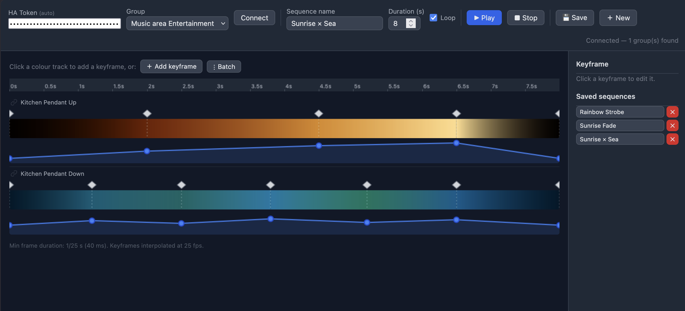
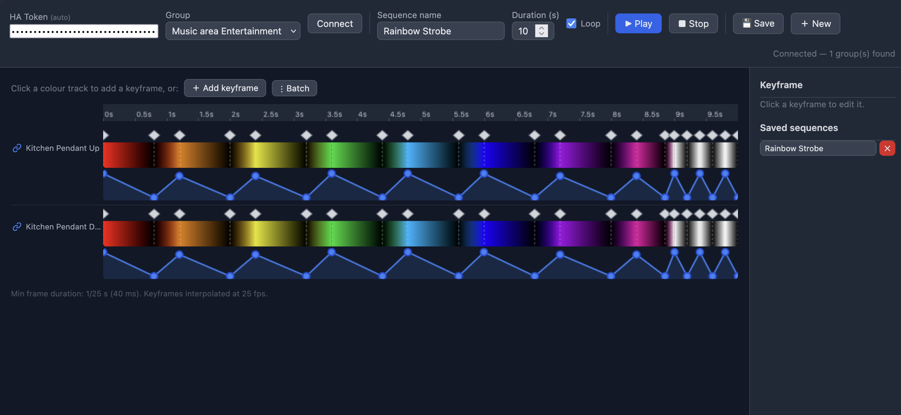

# ha-hue-entertainment-sequencer

A Home Assistant custom integration for the Philips Hue Entertainment API. Streams light commands directly to the Hue bridge over DTLS at **25 fps** — bypassing the cloud for ultra-low-latency effects — and includes a **keyframe timeline editor** served from your HA instance.



---

## Features

- **25 fps DTLS streaming** — direct UDP to the bridge, no cloud round-trip
- **9 built-in effects** — Strobe, Flash, Pulse, Color Cycle, Theater, Candle, Police, Confetti, Static
- **Keyframe sequence player** — interpolates colour and brightness between keyframes at 25 fps
- **Per-light independent tracks** — link/unlink lights in the editor to run different sequences per bulb
- **Live editing during playback** — hot-swap keyframes without restarting or jumping to t=0
- **Save / load named sequences** — sequences persist in HA storage and appear as effects on the entity
- **Visual timeline editor** — canvas-based editor with colour gradient track, brightness curve, playhead, and batch keyframe insertion
- **Auto-auth** — editor reads the HA session token from localStorage so no manual paste needed when opened in the same browser as your HA instance
- **DTLS transport** — tries `pyOpenSSL` first (ships with HA), falls back to the `openssl` binary if not available

---

## Requirements

- Home Assistant 2024.1 or newer
- Philips Hue Bridge v2 (the square one)
- At least one **Entertainment area** configured in the Hue app
- The integration creates one `light` entity per entertainment area

> **Alpine / Docker users:** the HA container is Alpine-based. If `pyOpenSSL` DTLS is unavailable, the integration falls back to the `openssl` binary. Add this to your `compose.yaml` entrypoint to ensure it is present:
>
> ```yaml
> entrypoint: ["/bin/sh", "-c", "apk add --no-cache openssl 2>/dev/null; exec /init"]
> ```

---

## Installation

### Manual

1. Copy `custom_components/hue_entertainment/` into your HA configuration directory (the folder that contains `configuration.yaml`).
2. Copy `www/hue_timeline.html` into your HA `www/` folder (create it if it does not exist).
3. Restart Home Assistant.
4. Go to **Settings → Devices & Services → Add Integration** and search for **Hue Entertainment**.

### HACS (custom repository)

1. In HACS, go to **Integrations → ⋮ → Custom repositories**.
2. Add this repository URL, category **Integration**.
3. Install **Hue Sequencer** and restart HA.
4. Copy `www/hue_timeline.html` manually into your `www/` folder (HACS does not manage frontend files).

---

## Setup

### 1. Create an Entertainment area in the Hue app

Open the Hue app → **Entertainment areas** → create an area and assign the lights you want to control.

### 2. Add the integration

Go to **Settings → Devices & Services → Add Integration → Hue Entertainment**.

- The integration will attempt auto-discovery of your bridge IP via `discovery.meethue.com`.
- Confirm or enter the IP manually, then press **Submit**.
- When prompted, **press the physical button on your Hue bridge** and click Submit again within ~30 seconds.
- The integration registers itself with the bridge and stores the credentials automatically.

### 3. Verify entities

After setup you will see:

| Entity type | Name pattern | Purpose |
|---|---|---|
| `light` | `{Area} Entertainment` | Main entity — turn on/off, select effect, use in automations |
| `number` | `{Area} Strobe Hz` | Live strobe rate (1–50 Hz) |
| `number` | `{Area} Color Speed` | Colour rotation (0–2 rot/s) |
| `number` | `{Area} Pulse Rate` | Breathe rate (0–5 Hz) |
| `number` | `{Area} Brightness` | Master brightness (0–100 %) |

---

## Timeline Editor

The editor is served from your HA instance at:

```
http://YOUR-HA-ADDRESS/local/hue_timeline.html
```

If you open it in the same browser session as your HA frontend, the token is picked up automatically from `localStorage` and it connects on load.



### Interface

| Area | What it does |
|---|---|
| Colour track | Click to add a keyframe at that position; drag the diamond to move it; the gradient shows the interpolated colour between keyframes |
| Brightness track | Drag the dots up/down to set brightness at each keyframe; the curve shows interpolated values |
| Ruler | Time reference in seconds |
| Keyframe panel (right) | Edit selected keyframe's exact time, colour, and brightness |
| Link button (chain icon) | Per-light: linked tracks share keyframes; click to unlink and edit that light independently |

### Keyboard / mouse

| Action | Result |
|---|---|
| Click empty colour track | Add keyframe at that position (interpolated colour/brightness) |
| Drag diamond | Move keyframe in time |
| Drag brightness dot | Adjust brightness at that keyframe |
| `+` / `−` buttons | Nudge keyframe by 1/25 s |
| **Add keyframe** button | Insert in the largest gap |
| **Batch** button | Insert N evenly-spaced keyframes |

### Per-light tracks

When connected to a group with multiple lights, each light gets its own colour and brightness track. All tracks are **linked by default** (chain icon lit in blue) — editing one edits all. Click the chain icon on a track to **unlink** it; that light then has its own independent keyframe set. The unlinked track is driven separately while linked tracks continue to share the master timeline.

### Saving sequences

Click **Save** to store the sequence in HA. Saved sequences appear under `saved_sequences` in the entity's state attributes and as named effects in the entity's effect list — you can trigger them from automations:

```yaml
service: light.turn_on
target:
  entity_id: light.living_room_entertainment
data:
  effect: "Sunrise"
```

---

## Services

### `hue_entertainment.start_effect`

Start a built-in effect.

| Field | Type | Default | Description |
|---|---|---|---|
| `entity_id` | entity | required | Entertainment group `light` entity |
| `effect` | string | `Static` | `Strobe`, `Flash`, `Pulse`, `Color Cycle`, `Theater`, `Candle`, `Police`, `Confetti` |
| `hz` | float | 25 | Strobe rate (Strobe effect) |
| `flash_count` | int | 3 | Number of flashes (Flash effect) |
| `pulse_rate` | float | 0.5 | Breathe cycles/s (Pulse / Theater) |
| `cycle_speed` | float | 0.1 | Colour rotations/s (Color Cycle / Theater) |
| `rgb_color` | list | `[255,255,255]` | Base colour |
| `brightness` | int | 255 | 0–255 |

### `hue_entertainment.stop`

Stop streaming and return lights to normal HA control.

### `hue_entertainment.play_sequence`

Play a one-off keyframe sequence (not saved). Used by the timeline editor.

```yaml
service: hue_entertainment.play_sequence
data:
  entity_id: light.living_room_entertainment
  sequence:
    duration: 4
    loop: true
    keyframes:
      - { t: 0, r: 255, g: 0,   b: 0,   brightness: 1.0 }
      - { t: 2, r: 0,   g: 0,   b: 255, brightness: 0.5 }
      - { t: 4, r: 255, g: 0,   b: 0,   brightness: 1.0 }
```

Per-light format (unlinked tracks):

```yaml
sequence:
  duration: 4
  loop: true
  lights:
    "0":
      keyframes:
        - { t: 0, r: 255, g: 0, b: 0, brightness: 1.0 }
        - { t: 4, r: 255, g: 0, b: 0, brightness: 1.0 }
    "1":
      keyframes:
        - { t: 0, r: 0, g: 0, b: 255, brightness: 1.0 }
        - { t: 4, r: 0, g: 0, b: 255, brightness: 1.0 }
```

### `hue_entertainment.update_sequence`

Hot-swap sequence data on a **running** effect without restarting or jumping to t=0. The timeline editor calls this during live editing so changes appear immediately on your lights.

### `hue_entertainment.save_sequence`

Persist a named sequence to HA storage. Appears as a named effect on all entertainment group entities.

### `hue_entertainment.delete_sequence`

Remove a saved sequence by name.

### `hue_entertainment.create_area` / `update_area` / `delete_area`

Manage entertainment areas on the bridge directly from HA. Useful if you do not want to open the Hue app.

---

## Effects reference

| Effect | Description | Live params |
|---|---|---|
| **Strobe** | Rapid on/off flash | `strobe_hz` |
| **Flash** | N flashes then stops | `flash_count` |
| **Pulse** | Smooth brightness breathe | `pulse_rate`, `rgb_color` |
| **Color Cycle** | Rainbow rotation across all lights | `color_speed`, `brightness` |
| **Theater** | Colour rotation + brightness pulse combined | `color_speed`, `pulse_rate`, `brightness` |
| **Candle** | Warm flicker with random brightness | `brightness` |
| **Police** | Red/blue alternating | — |
| **Confetti** | Random colours every frame | — |
| **Sequence** | Keyframe player (25 fps interpolated) | via `update_sequence` service |

---

## Architecture

```
Home Assistant
  └── hue_entertainment (custom_component)
        ├── light.py          — one LightEntity per entertainment area
        ├── number.py         — live-parameter NumberEntities (strobe_hz, etc.)
        ├── stream.py         — DTLS stream manager + effect engine
        │     ├── _PyOpenSSLBackend   — pyOpenSSL DTLS (preferred)
        │     └── _OpenSSLBinaryBackend — openssl subprocess fallback
        ├── __init__.py       — service registration, area management
        ├── config_flow.py    — bridge discovery + push-link auth
        └── services.yaml

www/
  └── hue_timeline.html      — standalone keyframe editor (no build step)
```

**Transport:** DTLS 1.2 PSK over UDP port 2100. PSK identity = bridge `username`, PSK = hex-decoded `clientkey` (16 bytes). Cipher: `TLS_PSK_WITH_AES_128_GCM_SHA256`.

**Stream message:** 16-byte header (`HueStream` magic + version + sequence + reserved + colorspace bytes) followed by 9 bytes per light (`0x00` type + uint16 light ID + 3× uint16 RGB 0–65535).

**Effect engine:** asyncio tasks run at 25 fps and read `self._params` every frame, so any parameter change (including a new `PARAM_SEQUENCE` dict) takes effect on the next frame without cancelling or restarting the task.

**Sequences:** keyframes are sorted by `t` and linearly interpolated. The `lights` dict format drives each light independently by positional index into the entertainment area's light list.

---

## Troubleshooting

**`Neither pyOpenSSL DTLS nor openssl binary available`**  
Add `apk add --no-cache openssl` to your compose entrypoint (see Requirements above).

**Lights don't respond but no error**  
Check that the entertainment area is still active in the Hue app — the bridge disables streaming after 10 s of silence. The keepalive in `stream.py` prevents this during active playback, but if HA restarts with an effect running the bridge may need re-enabling.

**Integration not found after install**  
Ensure the folder is named exactly `hue_entertainment` (underscore, not hyphen) inside `custom_components/`.

**Timeline editor shows "Not connected"**  
Open the editor in the same browser as your HA frontend (so the auto-auth token is available), or paste a long-lived access token from **Profile → Security → Long-lived access tokens**.

---

## Known Limitations

**Entertainment API brightness cap (~50% of maximum)**  
The Hue Entertainment API (Signify firmware) intentionally caps lights at approximately 50% of their maximum brightness during streaming mode. This is a deliberate firmware constraint — Signify reserves headroom to allow fast frame transitions without saturating the driver electronics. It is not a bug in this integration. If you need full brightness, use the standard Hue integration instead (which uses the normal clip/v2 API and has no such cap).

---

## License

MIT
